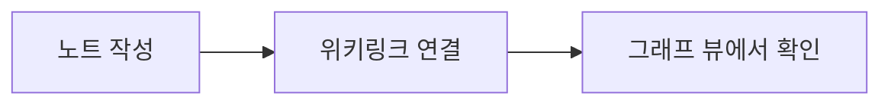

# 기능 둘러보기

AccessLens가 지원하는 마크다운/옵시디언 문법을 한 화면에 모아봤습니다.

## 콜아웃

> [!warning] 주의
> 콜아웃은 `> [!타입] 제목` 형식으로 씁니다. info/warning/tip/danger 등을 지원합니다.

## 표

| 역할 | 권한 | LDAP 그룹 |
|---|---|---|
| adm | 읽기·쓰기·삭제 | adm |
| dev | 읽기·쓰기 | dev |
| view | 읽기 전용 | view |

## Mermaid 다이어그램

## 노트 타입

프론트매터에 `type:`을 적으면(이 노트는 `guide`) `그래프` 탭에서 타입별로 다른 색
점으로 표시되고 우측 상단에 범례가 뜹니다. 값은 자유롭게 정하면 됩니다 — 예:
`person`, `project`, `component`, `incident`.

## 위키링크

다른 노트로 이동하려면 이렇게 씁니다: [[두번째-노트|두 번째 노트로 이동]]

## 이미지

이미지는 `attachments/` 폴더에 넣고 `![[파일명]]`으로 참조하세요. 웹 편집 화면의
"이미지 추가" 버튼을 쓰면 자동으로 이 폴더에 올라갑니다.
