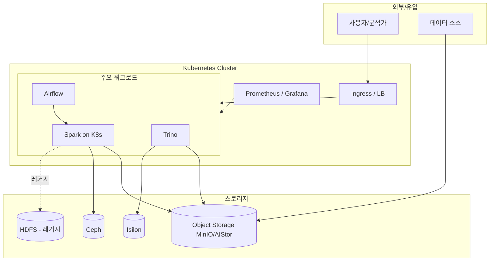

# 전체 시스템 아키텍처

> [!tip] 그림 우선
> 실제 구성에 맞게 아래 mermaid를 수정하거나 이미지를 `attachments/`에 넣고 첨부하세요.

## 구성 요소별 역할

| 구성 요소 | 역할 |
|---|---|
|  |  |

## 네트워크 구성 / 방화벽 특이사항

-

## 온프레미스(T-Hadoop) ↔ K8s 전환 현황

- 전환 배경: [[05-프로젝트-성과/3-1-K8s-신규플랫폼-구축]], [[05-프로젝트-성과/3-6-T-Hadoop-레거시운영]]
- 남은 작업:

## 관련

- [[03-클러스터-운영/클러스터-개요]]
