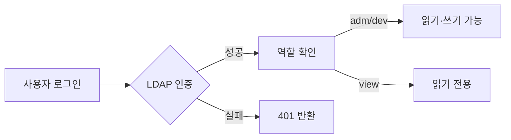
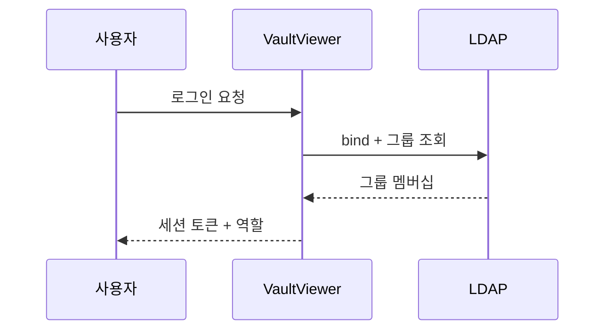

# Mermaid 테스트

VaultViewer에서 마크다운 코드 블록에 `mermaid` 언어 태그를 붙이면 코드 대신 다이어그램으로 렌더링됩니다. 이미지 업로드 테스트도 겸해서 아래에 붙여봅니다.

## 표 테스트

| 항목 | 설명 | 비고 |
|---|---|---|
| 역할 | adm/dev/view | LDAP 그룹 매핑 |
| 모드 | LOCAL/CLUSTER | 배포 시 결정 |
| 감사 로그 | 생성/수정/삭제 기록 | 사유 포함 |

![[image_c61872d3_549b10.png]]

![[testimg.png]]

## 플로우차트

## 시퀀스 다이어그램

